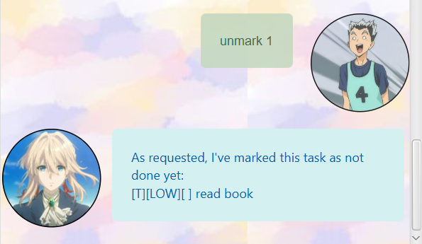
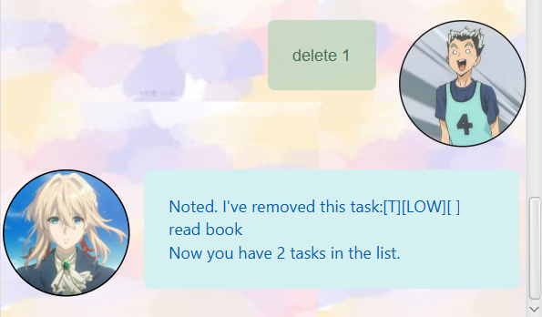

# User Guide

---

Pikachu Task Manager is an application that aims to help you manage your task better!


## Features 

### Manage Tasks
Perform task managing function.
- Add Todo/Event/Deadline
- Delete current tasks
- Mark current tasks as complete/incomplete

### Find Tasks

Find tasks that contain a keyword.

### Save Tasks

All tasks saved to your computer and will be reloaded upon opening that app.


## Usage

### `todo` - Add a todo task

Example of usage:

`todo learn a new trick`

Expected outcome:

Shows a message for successful addition.

```
Pikapi(added): [T][ ] learn a new trick
Pikaaaaa: 1 task
```

---
### `event` - Add a event task

Example of usage:

`event student fair /at UTown`

Expected outcome:

Shows a message for successful addition.

```
Pikapi(added): [E][ ] student fair (at: UTown)
Pikaaaaa: 2 tasks
```

---
### `deadline` - Add a deadline task

Example of usage:

`deadline quiz /by 2022-09-27`

Expected outcome:

Shows a message for successful addition.

```
Pikapi(added): [D][ ] quiz (by: 27 September 2022)
Pikaaaaa: 3 tasks
```

---
### `mark` - Set task as done

Format:

`mark [index]`

Example of usage:

`mark 1`

Expected outcome:

```
Pi-ka(Done): [T][X] learn a new trick
```

---
### `unmark` - Set task as undone

Format:

`unmark [index]`

Example of usage:

`unmark 1`

Expected outcome:

```
Pi-ka(Done): [T][ ] learn a new trick
```

---
### `delete` - Delete a task

Format:

`delete [index]`

Example of usage:

`delete 1`

Expected outcome:

```
Pi-ka(Removed): [T][ ] learn a new trick
Pikaaaaa: 2 tasks
```

---
### `list` - Show status of all tasks

Example of usage:

`list`

Expected outcome:

```
PikaPika:
1.[E][ ] student fair (at: UTown)
2.[D][ ] quiz (by: 10 October 2022)
```

---
### `find` - Find tasks

Format:

`find [keyword]`

Example of usage:

`find quiz`

Expected outcome:

```
1.[D][ ] quiz (by: 27 September 2022)
```

---
### `bye` - Exits the program

Example of usage:

`bye`

Expected outcome:

```
Pi-ka...(Say some last word to pikachu to comfort it!)
```
Any words typed in after pikachu's replay will successfully exit the program.


---
