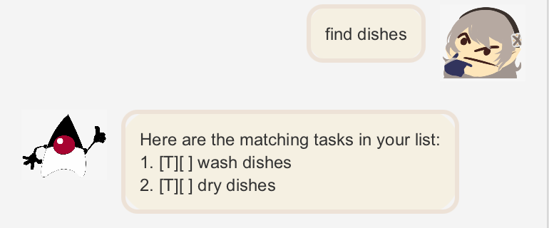

# User Guide

## Quick Start
1. Ensure you have Java 11 or above installed in your Computer.
2. Download the latest Duke.jar file from [here]().
3. Copy the file to the folder you want to use as the home folder.
4. Double-click the file to start the app. Alternatively, navigate to the home folder and use the command:
```
java -jar duke.jar
```
5. Type any of the commands to start using the task manager

## Features 

### Adding a todo

Adds a todo to the list.
A todo is a type of task, that only has a description.

### Adding a deadline

Adds a deadline to the list.
A deadline is a type of task, that has to be done by a given date.

### Adding a event

Adds an event to the list.
An event is a type of task, that occurs on a given date.

### Marking a task

Marks a task as done.

### Un-marking a task

Marks a task as not done.

### Deleting a task

Deletes a task from the list.

### Listing all current tasks

Shows the list of all current tasks.

### Locating a task by keyword

Finds all tasks whose description contains any of the given keywords.

### Locating a task by date

Finds all tasks which occur on the given date.

### Saving and exiting the program

Saves the current tasks and exits the program.

## Usage

### Notes about the command format:

- Words in `UPPER_CASE` are the parameters to be supplied by the user.
- e.g. in `todo DESCRIPTION`, `DESCRIPTION` is a parameter which can be used as `todo example`.

### `todo` - Adds a todo to the list

Adds a todo with a given description to the list.

Format: `todo DESCRIPTION`

Example: `todo wash dishes`

Expected outcome:

A todo with the given description will be added to the list.


### `deadline` - Adds a deadline to the list

Adds a deadline with a given description and due date to the list.

Date should be in the YYYY-MM-DD format.

Format: `deadline DESCRIPTION /by DATE`

Example: `deadline submit assignment /by 2022-09-15`

Expected outcome:

A deadline with the given description and date will be added to the list.


### `event` - Adds an event to the list

Adds an event with a given description and event date to the list.

Date should be in the YYYY-MM-DD format.

Format: `event DESCRIPTION /at DATE`

Example: `event concert /at 2022-09-20`

Expected outcome:

An event with the given description and date will be added to the list.


### `mark` - Marks a task as done

Marks the task at a given index as done.

Format: `mark INDEX`

Example: `mark 1`

Expected outcome:

The first task in the list will be marked as done.


### `unmark` - Marks a task as not done

Marks the task at a given index as not done.

Format: `unmark INDEX`

Example: `unmark 1`

Expected outcome:

The first task in the list will be marked as not done.


### `delete` - Deletes a task from the list

Deletes the task at a given index from the list

Format: `delete INDEX`

Example: `delete 2`

Expected outcome:

The first task in the list will be deleted.


### `list` - Shows the list of all current tasks

Shows the list of all current tasks.

Format: `list`

Expected outcome:

Displays all tasks currently in the list.


### `find` - Finds matching tasks by keyword

Finds all tasks that have a description containing the given keyword.

Format: `find KEYWORD`

Example: `find dishes`

Expected outcome:

Finds all matching tasks.



### `schedule` - Finds matching tasks by date

Finds all tasks that occur or is due on the given date.

Date should be in the YYYY-MM-DD format.

Format: `schedule DATE`

Example: `schedule 2022-09-20`

Expected outcome:

All tasks that occur or is due on the given date will be shown.


### `bye` - Saves and exits the program

Saves and exits the program

Format: `bye`

Expected outcome:

All the current tasks are saved and the program can be exited.
;


