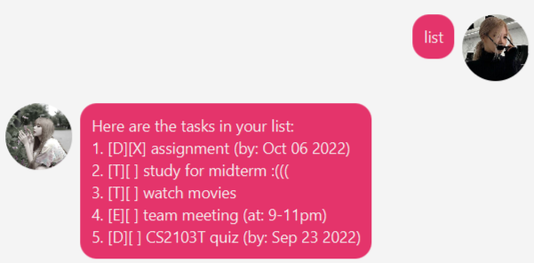
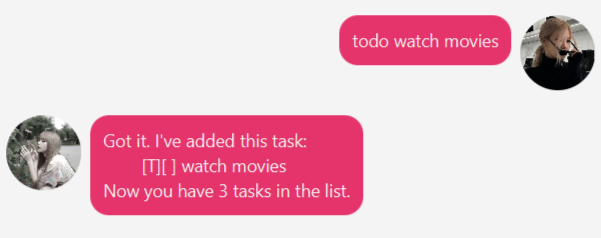
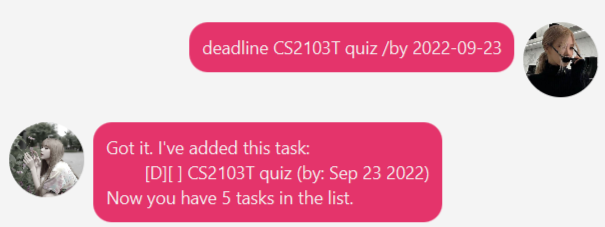
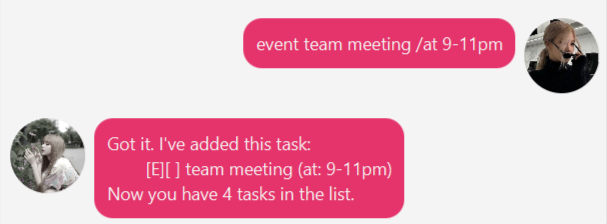
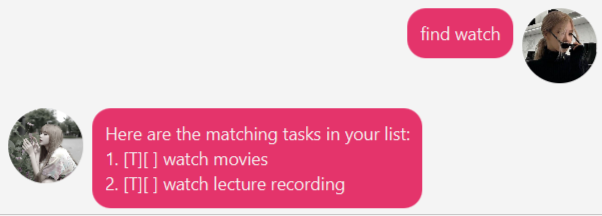
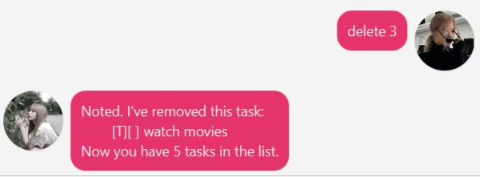

# User Guide

## Quickstart

> Note: Run the jar in the terminal instead of double-clicking on the jar file!

1. Copy the jar file into an empty folder
1. Open a command window in that folder
1. Run the command java -jar {filename}.jar e.g., java -jar Duke.jar (i.e., run the command in the same folder as the jar file)

## Features 

### Add

Add a todo/event/deadline to the task list.

### List

Lists all tasks in the task list.

### Mark/Unmark

Mark a task as done or not done.

### Delete

Delete a task.

### Find

Find tasks based on date with `on` or description with `find`.

### Bye

Close the application.

## Usage

### `list`

Lists all tasks in the task list.

Example of usage:

`list`

Expected outcome:

### `mark`

Marks a selected task as done.

Example of usage:

`mark 3`

Expected outcome:

### `unmark`

Marks a selected task as not done.

Example of usage:

`unmark 3`

Expected outcome:

### `todo`

Add a todo with a given description.

Example of usage:

`todo description which can have many words`

Expected outcome:

### `deadline`

Adds a deadline with a given description and due date.

Example of usage:

`deadline gess1025 report /by 2022-09-11`

Expected outcome:

### `event` 

Add an event with the given description and date.

Example of usage:

`event cs2103t lecture /at 2022-09-09`

Expected outcome:

### `find`

Find a task based on its description.

Example of usage:

`find cs1101s`

Expected outcome:

### `on`

Find tasks on a certain date.

Example of usage:

`on 2022-09-16`

Expected outcome:

### `delete`

Delete tasks. Supports deleting multiple indexes at once.

Example of usage:

`delete 4 6`

Expected outcome:

### `bye`

Closes the application.

Example of usage:

`bye`

Expected outcome:

The application is closed.
